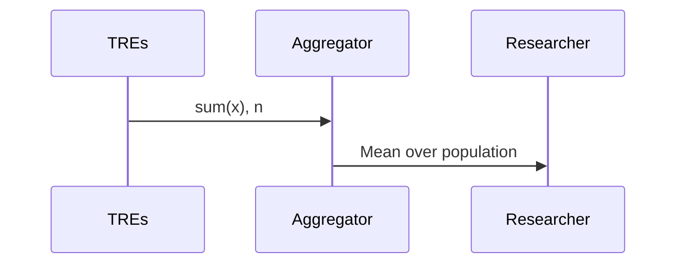
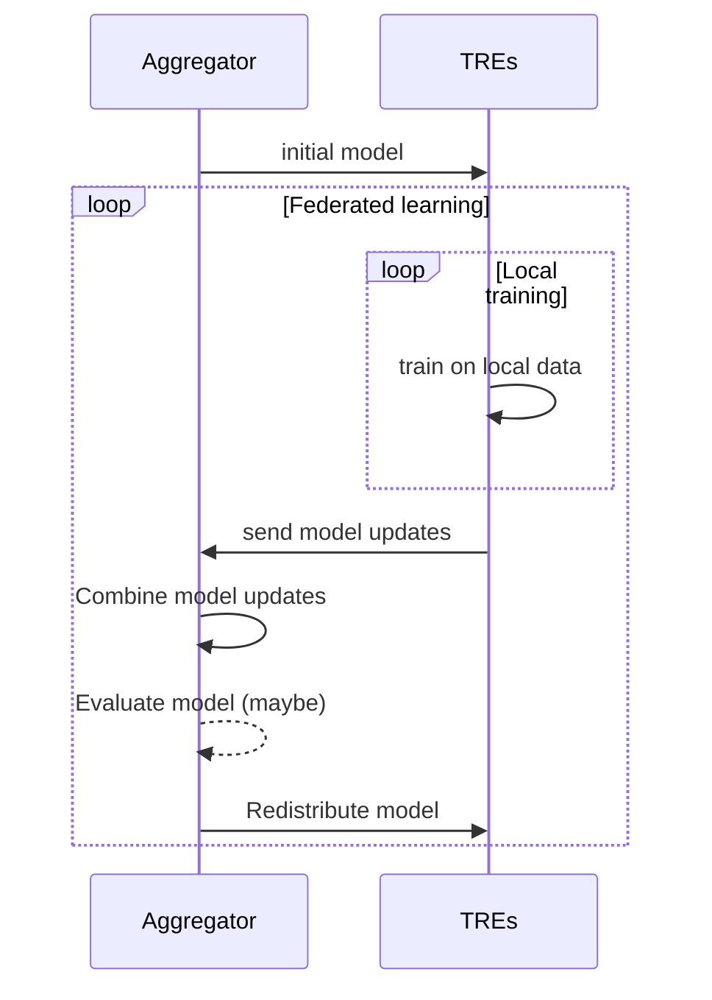
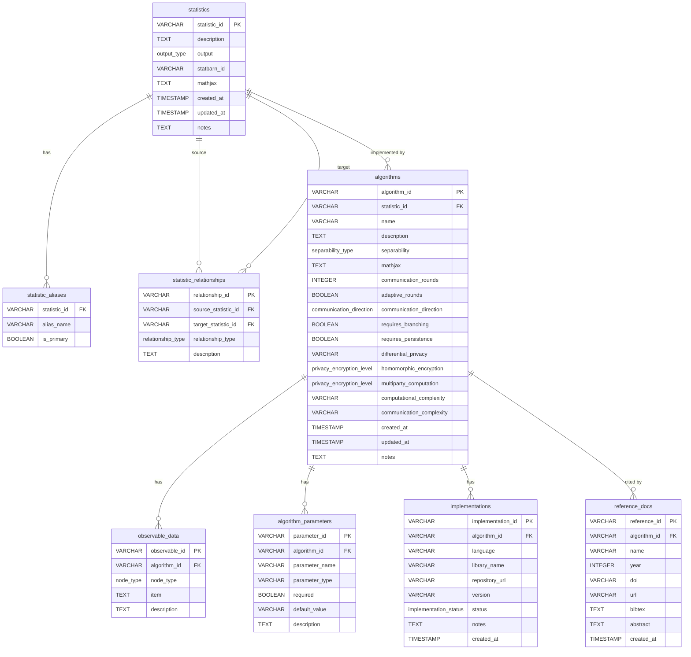

# Categorising analysis types

The aim of representing possible federated analysis methods is to make it easier for people involved in federated research to reason and communicate about what methods are possible.
There are three kinds of people this is aimed at, and ultimately we will aim to organise the information differently according to their concerns:

1. **Federation administrators**: people responsible for coordinating a federation of TREs. Their main concern is whether how their federation is organised will allow an analysis.
2. **TRE administrators**: people responsible for managing and operating a TRE. Their main concern is whether an analysis is (i) technically possible and (ii) permissible according to their capabilities and governance.
3. **Researchers**: people who want to submit analyses to TREs within a Federation in which they are an approved member of a project. Their main concern is whether they can do the analysis they want.

## Analysis
The first thing any of these people need to think about is whether the output of an analysis is acceptable to all parties.
If not, nothing else matters and you should go home.
To help make these decisions, we report the [StatBarn](https://outputchecking.org/statbarn/) for each analysis, where possible.

If you are lucky enough to want to do some research that everyone is happy with, you still need to make sure the way it is calculated is acceptable too, which is why we describe different federated *algorithms*.

### Aliases
Sometimes different fields will call the same statistic a different name.
Federated research should be a broad church, so we have tried to keep a record of other names somebody might call your favourite method.

### Relationships
Some analyses might be good approximations for another, or be a special case of a wider family.
We have captured some of these types of relationships so you can find the right analysis for a given federation more easily.

## Algorithm
All of these kinds of analysis could be done by sending all of everyone's data to one place, but nobody is going to let you do that, or you wouldn't be here.
Alternative algorithms for calculating these might be more acceptable for your federation, and the descriptions here are designed to make that decision easier.
The basic idea for each algorithm is described, then some technical attributes are described so you can filter out unacceptable algorithms.

### Decomposable analysis
The primary description of an analysis, which defines many of the other parameters, is whether an algorithm is decomposable; that is whether the computation can be split so that each TRE processes only its local data, producing summary statistics that an aggregator combines to produce the final result.
We record three variants of decomposability:

- **Fully decomposable**: Each TRE can compute some summary statistic that is sufficient to calculate the statistic for the whole population of the federation.
- **Non-decomposable**: Using this algorithm, the only option is to share your data.
- **Iteratively decomposable**: Algorithms that require multiple rounds of communication between TREs and an aggregator.

#### Examples
You can calculate the mean across a federation by computing the local count and sum and sending those to an aggregator.

This works because if you have the sum of a value, and the count of a population in each TRE, it does not matter whether you add all of them up in one place or separately.

There are lots of statistics you can't calculate this way though.
For example, there's no summary statistic you can send to an aggregator to exactly calculate the median in one round of communication like this, so (without clever encryption methods), the median is not decomposable.

Federated learning requires iteration to be useful.

Here, the TREs train the model on their local data, then send these updates back to the aggregator, where they are combined.
The updated model is sent back to TREs, and the process repeats until some criterion is reached.
There are a couple of important points about iteratively decomposable analyses.
First, some data might then be observed by other TREs, as they can see how the model has been updated each round.
In this example, it's not much of a disclosure risk, but what this information is varies by analysis.
Second, your federation needs to efficiently support multiple rounds of communication.

### Communication rounds
For iterative analyses, the number of rounds that need to be carried out might be known ahead of time, or the number might depend on some metric that can't be known ahead of time.
There will either be a number of rounds reported, or that the number is "adaptive".

### Communication directions
Depending on the specifications of the federation, it may be that the only way information can travel is the TREs sending data to an aggregator.
Some analyses require the aggregator to be able to send something (for example, model updates in federated learning) back to TREs.
This may or may not be compatible with either the technical capabilities or governance of a TRE.

### Execution environment
Some analysis requires complex branching of workflows, whereas others can be carried out in a linear fashion.
Some require an executor that can persist over multiple rounds, whereas others can be carried out by an executor that carries out a single task and then exits.
These capabilities depend on the execution environment provided in each TRE.

### Privacy-preserving measures
Differential privacy and encryption techniques mean that some analyses and algorithms that previously represented an unacceptable disclosure risk become acceptable.
This depends on the governance decisions of TREs and the federation.

### Observable data
During an analysis, some data will be observable by some other party.
Here, we make it transparent *who* can see *what*.

### Algorithm parameters
Running an algorithm may require some set-up, for example, sharing the initial model in federated learning.

### Implementations
Luckily, we live in a world where people share code.
If we can find an implementation of an algorithm that can be used in federated analysis, it can be reported.

### Reference documents
Random code from the internet might not persuade responsible researchers that an algorithm is acceptable or useful for their purpose.
Luckily, peer-reviewed literature should represent a higher standard of reliability, so academic sources may be included.

## ERDs for nERDs

If you like diagrams, here is an entity relationship diagram for the schema used to model analyses and algorithms.

