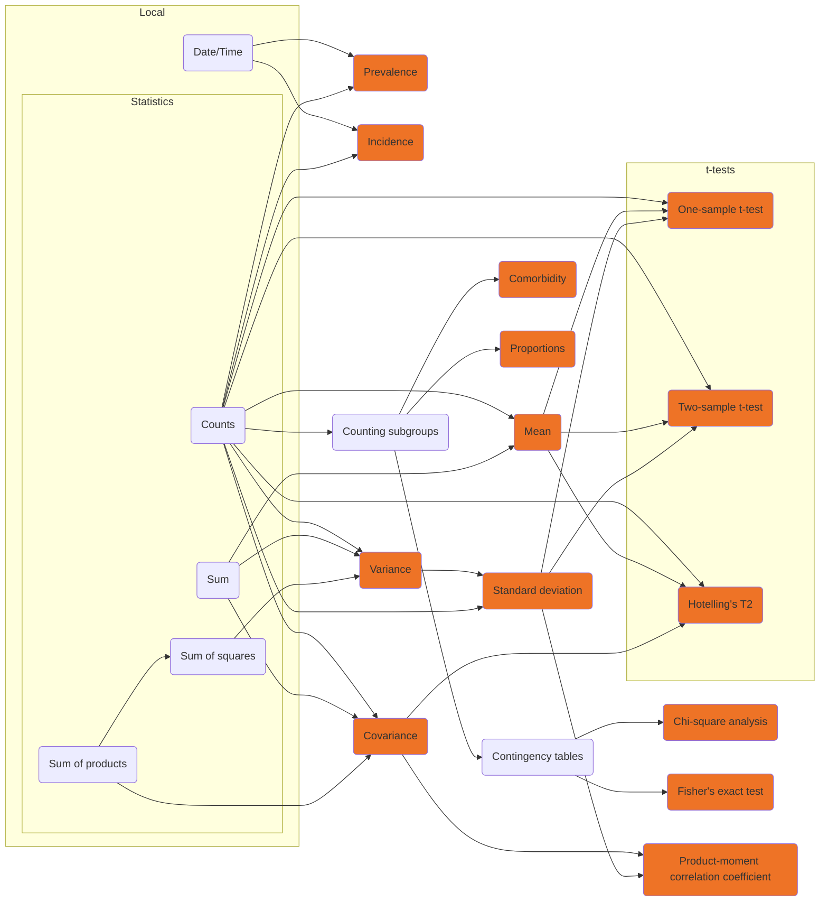

# Decomposable analysis

Generally, a decomposable analysis consists of two parts: some function on the data in each node, and a function used to aggregate the outputs from each node.
If you want to carry out basic statistics, you can get a lot by combining a few of these functions.
Below, there is a demonstrator to help you get a feel for how a decomposable analysis can work.

```js
import { runInner, computeAggregate } from "./components/aggregateFunctions.js";
import { analyses } from "./components/decomposables.js";
import { displayIntermediates, displayNodes, displayArrows } from "./components/drawDiagrams.js";
import { populateNodes } from "./components/renderNodes.js";
```

```js
const analysisChoice = view(
  Inputs.select(
    analyses,
    {
      label: "Choose an analysis",
      format: (t) => t.label,
      value: analyses.find((t) => t.label === "Count All")
    }
  )
)
```

# ${analysisChoice.label}

Overall, this analysis ${analysisChoice.decomposableDescription}

## Running an example

Here are some text boxes.
It has some example data in it that will work for the kinds of analysis that take a single number from each row of a dataset.
You can put your own numbers in, just separate them with commas.


```js
const nodeN = view(Inputs.button(
  [
    ["Add Node", value => value + 1],
    ["Remove Node", value => value >= 2 ? value - 1 : value]
  ], {value: 3}
))
```

```js
const dummyNodes = view(populateNodes(nodeN))
```

This page will pretend that this is a dataset held across different nodes.


```js
const dummyData = dummyNodes.map(d => JSON.parse(`[${d}]`))
```


```js
const intermediates = runInner(analysisChoice.inner, dummyData)
```


```js
const dataNodes = html`${displayNodes(dummyData.length)}`;
const intermediatesRepr = html`${displayIntermediates(intermediates)}`;
const arrows = html`${displayArrows(dummyData.length)}`;
const arrows2 = html`${displayArrows(dummyData.length)}`;
```

## Functions

### Inner function
The way it does this is by applying an inner function to each of the datasets.
The inner function, "${analysisChoice.innerDescription.label}", ${analysisChoice.innerDescription.description}

### Outer function

The analysis takes the output of ${analysisChoice.innerDescription.label} for each dataset and applies an outer function to these intermediate values.
The outer function, "${analysisChoice.outerDescription.label}", ${analysisChoice.outerDescription.description}

<div class="card">
  ${dataNodes}
  <div style="display:flex; justify-content:center;">
      ${analysisChoice.innerDescription.label}
  </div>
  ${arrows}
  ${intermediatesRepr}
  <div style="display:flex; justify-content:center;">
      ${analysisChoice.outerDescription.label}
  </div>
  ${arrows2}
  <div style="display: flex;
              justify-content: center;
              background: #EE7326;
              margin-left: 30px;
              margin-right: 30px;
              border-radius: 5px;">
    <span><b>Final Result:</b> ${computeAggregate(analysisChoice, dummyData)}</span>
  </div>
</div>

## Other statistics

This page only describes a few examples of the statistics that can be federated, if you can just calculate the counts, sums, and the sum of the products of variables in each node.
Some more common statistics can be federated from these parts, as shown in the diagram below.
In addition, many domain-specific statistics can be decomposed.
If you are trying to figure out whether that is true for yours, you need to find some set of statistics that can be calculated at a node, and some function for combining them at an aggregator.


