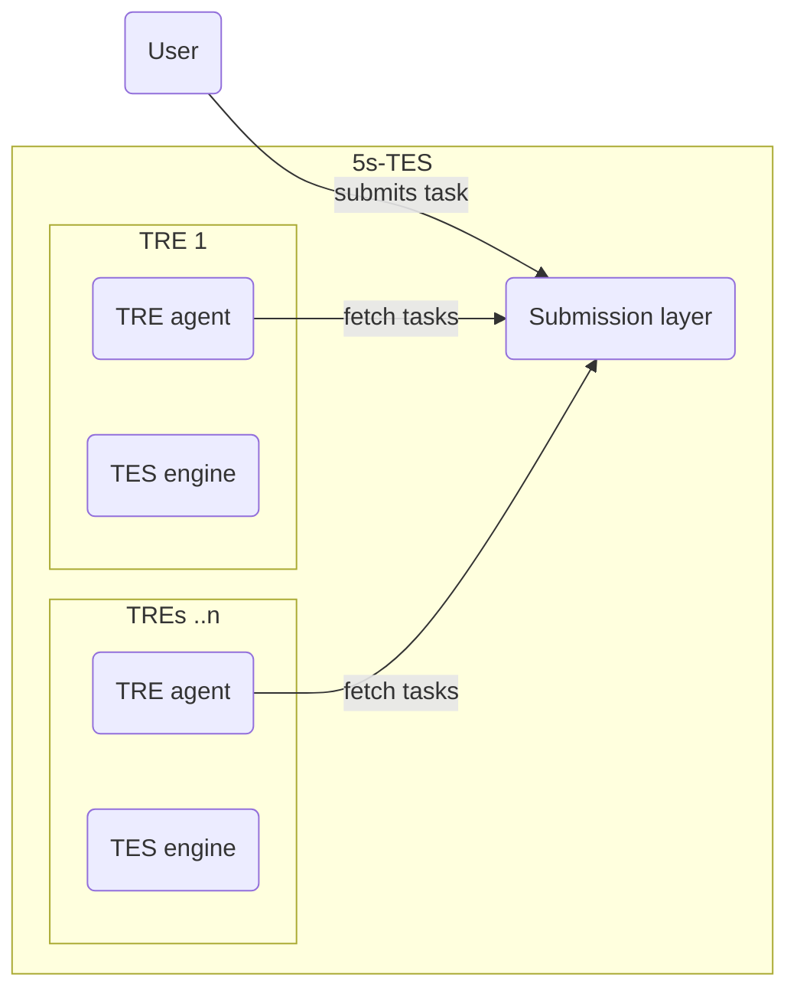

# Examples in Five Safes TES

Five Safes TES ([5s-TES](https://docs.federated-analytics.ac.uk/five_safes_tes)) provides a way to perform isolated analyses across TREs.
This section provides examples of how to perform these kinds of analysis using 5s-TES.

## The Five Safes
> [The Five Safes framework](https://ukdataservice.ac.uk/help/secure-lab/what-is-the-five-safes-framework/) is a set of principles which enable data services to provide safe research access to data.

5s-TES enables federated analytics which adhere to these principles.

| Safe | 5s-TES support |
| ---- | -------------- |
| Safe data | Data is de-identified and only the minimum amount of data required for an approved project is made available |
| Safe projects | Analytics can only be performed within an approved project |
| Safe people | Only approved people can submit jobs |
| Safe settings | Execution happens within the TRE |
| Safe outputs | Any outputs of execution have to go through disclosure control before they can be used |

## TES

The [Global Alliance for Genomics and Health](https://www.ga4gh.org/) (GA4GH) [Task Execution Service](https://www.ga4gh.org/product/task-execution-service-tes/) is an open, standardised mechanism for running computational tasks remotely.
TES works by sending a standard format of HTTP requests to a server, which interprets these requests to run some task in its environment.

You do not need to know how to write this format to use 5s-TES, which has [tools](examples-in-five-safes-tes/submitting-to-5s-tes#methods) to help you.

In 5s-TES, the TES server sits inside a TRE, so tasks are executed inside the TRE, and can access **Safe data** for an approved project.

## How 5s-TES works

5s-TES uses the TES standard to run tasks inside TREs.
Running unapproved TES tasks would not be safe, so the architecture of 5s-TES is set up to protect data in the TREs.
Tasks have to be sent to a [Submission layer](#submission-layer) by an [authenticated](examples-in-five-safes-tes/submitting-to-5s-tes#authentication) user, which orchestrates how tasks are distributed to TREs.

When a task runs, its outputs are held for [disclosure control](#egress) in the TRE.

### Task overview

  

    

      
1

      

    

    

      
<a href="examples-in-five-safes-tes/submitting-to-5s-tes">Send 5s-TES message to Submission layer</a>

      
Submission layer handles orchestration, etc.

    

  

  

    

      
2

      

    

    

      
TRE picks up task from Submission layer

      
Software inside the TRE configures e.g. database credentials for your project.

    

  

  

    

      
3

      

    

    

      
One or more <a href="examples-in-five-safes-tes/executors">executors run the task</a>

    

  

  

    

      
4

      

    

    

      
Outputs go through disclosure control

      

        The executor writes results to a file, which is held in the TRE.
        A TRE output checker then reviews the output to check that it is safe, after which the researcher is notified.
      

    

  

  

    

      
5

    

    

      
Researcher <a href="examples-in-five-safes-tes/collecting-results">collects output</a>

      

        The researcher can then log in to the outputs bucket and download the outputs.
        These files can then be used to aggregate the results of a federated analysis.
      

    

  

### Submission layer

### Other layers
Researchers using 5s-TES will not interact with the other layers.

- **The Controller layer**:
  - **TRE agent**: Manages tasks sent to the TES engine.
  - **Egress**: Allows output checkers to approve or reject outputs.
- **The Analysis Execution layer**: contains the TES engine that carries out tasks.

If you're interested in how these layers work, please [consult the 5s-TES documentation](https://docs.federated-analytics.ac.uk/five_safes_tes).

### Egress
To ensure **Safe outputs**, the outputs created by a task are held before releasing them outside the TRE.
TREs then have rules on the egress of outputs, usually requiring manual review.

## Examples
This site includes examples of how to use 5s-TES to carry out federated analytics

- **[Discovery using OMOP metadata](./examples-in-five-safes-tes/discovery)**: When using 5s-TES, the user does not have access to view data prior to analysis, which makes it considerably more difficult to analyse the data. How does a researcher know what analysis to perform, or even if the data is appropriate for their work? The answer is to use summary data of the data set, a process known as cohort discovery.
- **SQL examples**: One application of 5s-TES is to run queries that provide the right summary statistics for your analysis. These examples demonstrate the use of [SQL](https://en.wikipedia.org/wiki/SQL) to make requests to databases held in two, separate TREs.
    - **[Contingency tables](./examples-in-five-safes-tes/contingency-tables)**: building a contingency table using SQL
    - **[Descriptive statistics](./examples-in-five-safes-tes/descriptive-statistics)**: calculating the mean and variance of a continuous variable for a defined cohort
