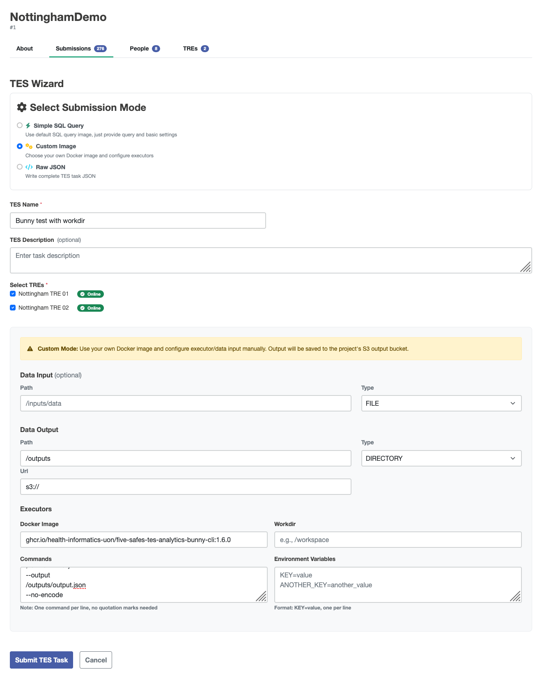

# Visualising OMOP metadata
This tutorial can be run as a Jupyter notebook in the [5s-TES notebooks repository](https://github.com/Health-Informatics-UoN/5s-TES-notebooks/tree/main/OMOP-metadata), which also contains the utilities used to visualise OMOP metadata.

There are two examples of outputs from a Bunny distribution query included in the test data.
This kind of data can be obtained from Five Safes TES (5STES) by submitting a TES message, which can be created by using the [custom image wizard](submission-layer-wizards#custom-image):


The settings need to be:

- **Docker Image**: ghcr.io/health-informatics-uon/five-safes-tes-analytics-bunny-cli:1.6.0
- **Commands**:
```
--body-json
{"code":"GENERIC","analysis":"DISTRIBUTION","uuid":"123","collection":"test","owner":"me"}
--output
/outputs/output.json
--no-encode
```

<details>
    <summary>The wizard will generate a TES message (expand for an example).</summary>

```json
{
         "id": "someID",
         "state": 0,
         "name": "Bunny testing",
         "description": null,
         "inputs": null,
         "outputs": [
                  {
                           "name": "Query Results",
                           "description": "Results from the requested query execution",
                           "url": "s3://",
                           "path": "/outputs",
                           "type": "DIRECTORY"
                  }
         ],
         "resources": null,
         "executors": [
                  {
                           "image": "ghcr.io/health-informatics-uon/five-safes-tes-analytics-bunny-cli:1.6.0",
                           "command": [
                                    "--body-json",
                                    "{\"code\":\"GENERIC\",\"analysis\":\"DISTRIBUTION\",\"uuid\":\"123\",\"collection\":\"test\",\"owner\":\"me\"}",
                                    "--output",
                                    "/outputs/output.json",
                                    "--no-encode"
                           ],
                           "workdir": null,
                           "stdin": null,
                           "stdout": null,
                           "stderr": null,
                           "env": null
                  }
         ],
         "volumes": null,
         "tags": {
                  "project": "someProject",
                  "tres": "someTREs"
         },
         "logs": null,
         "creation_time": null
}

```
</details>

We have provided some utilities to help users interpret the outputs of these distribution queries, importable from `bunny_utils`.

```python
from five_safes_tes_analytics.utils.parse_bunny import parse_bunny
from bunny_utils import DistributionCodesets, count_bar
import warnings
warnings.filterwarnings('ignore')
```

The examples "1k TRE" and "100k TRE" are taken from the synthetic OMOP datasets held in University of Nottingham test TREs.
The other examples are dummy data created for this demonstration.
Running the wizard, you should be able to egress files for your output.
Hopefully, you've kept track of which files come from which TRE.

Initialising a `DistributionCodesets` object with a dictionary with names you recognise and the paths to the files means that visualisations etc. will keep those labels.


```python
bunny_table_names = {
    "1k TRE": "../tests/test-data/1kconcepts.json",
    "100k TRE": "../tests/test-data/100kconcepts.json",
    "Narnia": "bunny-dummy-data/narnia-tsv-dummy.json",
    "The Moon": "bunny-dummy-data/the-moon-tsv-dummy.json",
    "Tingham": "bunny-dummy-data/tingham-tsv-dummy.json"
}
```


```python
codesets = DistributionCodesets(bunny_table_names)
```

You can look at the raw tables from the query in the `.tables` attribute.


```python
codesets.tables["1k TRE"].head()
```

| TRE | BIOBANK | CODE | COUNT | ALTERNATIVES | DATASET | OMOP | OMOP_DESCR | CATEGORY | 
| --- | ------- | ---- | ----- | ------------ | ------- | ---- | ---------- | -------- |
| 1k TRE | test | OMOP:0 | 580 | NaN | NaN | 0 | No matching concept | Condition |
| 1k TRE | test | OMOP:28060 | 150 | NaN | NaN | 28060 | Streptococcal sore throat | Condition |
| 1k TRE | test | OMOP:75036 | 20 | NaN | NaN | 75036 | Localized, primary osteoarthritis of the hand | Condition |
| 1k TRE | test | OMOP:78272 | 50 | NaN | NaN | 78272 | Sprain of wrist | Condition |
| 1k TRE | test | OMOP:80502 | 50 | NaN | NaN | 80502 | Osteoporosis | Condition |

You can get the counts for each code on each TRE with the `counts_by_TRE` property.


```python
codesets.counts_by_TRE.head()
```

You can view how many codes your TREs have in common with the `code_intersections` property.
This example shows that the 100k and 1k TREs share 7 codes, that "100k TRE" has 8885 unique codes, and the "1k TRE" has 361 unique codes.

```python
codesets.code_intersections
```

|     |     |
| --- | --- |
| \['100k TRE', '1k TRE'\] | 	7 |
| \['100k TRE', 'Narnia', 'The Moon', 'Tingham'\] | 	16 |
| \['100k TRE', 'Narnia', 'The Moon'\] | 	1 |
| \['100k TRE', 'Tingham'\] | 	3 |
| \['100k TRE'\] | 	8865 |
| \['1k TRE', 'Narnia', 'The Moon', 'Tingham'\] | 	2 |
| \['1k TRE'\] | 	359 |
| \['Narnia', 'The Moon', 'Tingham'\] | 	1056 |
| \['Narnia', 'The Moon'\] | 	925 |
| \['Tingham'\] | 	921 |


You can plot the k codes with the highest counts using `.plot_top_k_by_count(k)`.
If you run this notebook, you can hover over the bars to get the OMOP description of that code.

```python
codesets.plot_top_k_by_count(10)
```

```js
const top10Plot = FileAttachment("../data/vega-plots/count-top-10.json").json();
```

```js
vl.render({
  spec: {
    width: 600,
    height: 400,
    data: {values: top10Plot.datasets["data-a728793463941ee04eb23777eacf1e87"]},
    mark: "bar",
    encoding: top10Plot.encoding
  }
})
```

If you have codes that you're interested in, you can use the `.plot_by_codes(list_of_codes)` method to get a barplot of those.


```python
codesets.plot_by_codes([28060, 3000905])
```

```js
const countByCodes = FileAttachment("../data/vega-plots/count-by-codes.json").json()
```

```js
vl.render({
  spec: {
    width: 600,
    height: 200,
    data: {values: countByCodes.datasets["data-e89cded756829d18dd1becc550a02ca3"]},
    mark: "bar",
    encoding: countByCodes.encoding
  }
})
```

You can combine this method with ways of generating lists of codes, for example, getting the list of codes that are shared between some TREs, using the `.get_codes_by_membership` method.
These are the codes shared by both of the synthetic datasets.


```python
codesets.plot_by_codes(codesets.get_codes_by_membership("['100k TRE', '1k TRE']")["OMOP"])
```


```js
const countByIntersection = FileAttachment("../data/vega-plots/count-by-intersection.json").json()
```

```js
vl.render({
  spec: {
    width: 600,
    height: 400,
    data: {values: countByIntersection.datasets["data-c04c945ec29ce9a29b27390dd3cde0d6"]},
    mark: "bar",
    encoding: countByIntersection.encoding
  }
})
```


Or if you don't have a set of codes you want to query, but do have some substring to match, you can use the `get_codes_by_substring_match` method. This is case-insensitive and supports regular expressions.


```python
codesets.plot_by_codes(codesets.get_codes_by_substring_match("leuko")["OMOP"])
```

```js
const countBySubstring = FileAttachment("../data/vega-plots/count-by-substring.json").json()
```

```js
vl.render({
  spec: {
    height: 800,
    width: 600,
    mark: "bar",
    data: {values: countBySubstring.datasets["data-23db58bc3def801d6732df0a39f3852e"]},
    encoding: countBySubstring.encoding
  }
})
```


You can get a heatmap of how many codes are in each combination of datasets as a heatmap with `.plot_count_heatmap`


```python
codesets.plot_count_heatmap().properties(width=600, height=600)
```

```js
const heatmap = FileAttachment("../data/vega-plots/heatmap.json").json()
```

```js
vl.render({
  spec: {
    height: 600,
    width: 600,
    mark: heatmap.mark,
    data: {values: heatmap.datasets["data-66c0c809ab4b5af683a377e644596847"]},
    encoding: heatmap.encoding
  }
})
```

You can also get an [Upset plot](https://upset.app/) for your datasets.
This is like a Venn diagram, but instead of numbers written in circles, you get bars proportional to the number of codes present in each combination of TREs.
This shows the same information as the `code_insersections` property.
If you only have a couple of TREs, this isn't terribly useful, but once you have more than three, the number of combinations is much higher, and Venn diagrams get hard to read.


```python
codesets.plot_upset()
```

```js
const upset = FileAttachment("../data/vega-plots/upset.json").json()
```

```js
vl.render({spec: upset})
```
