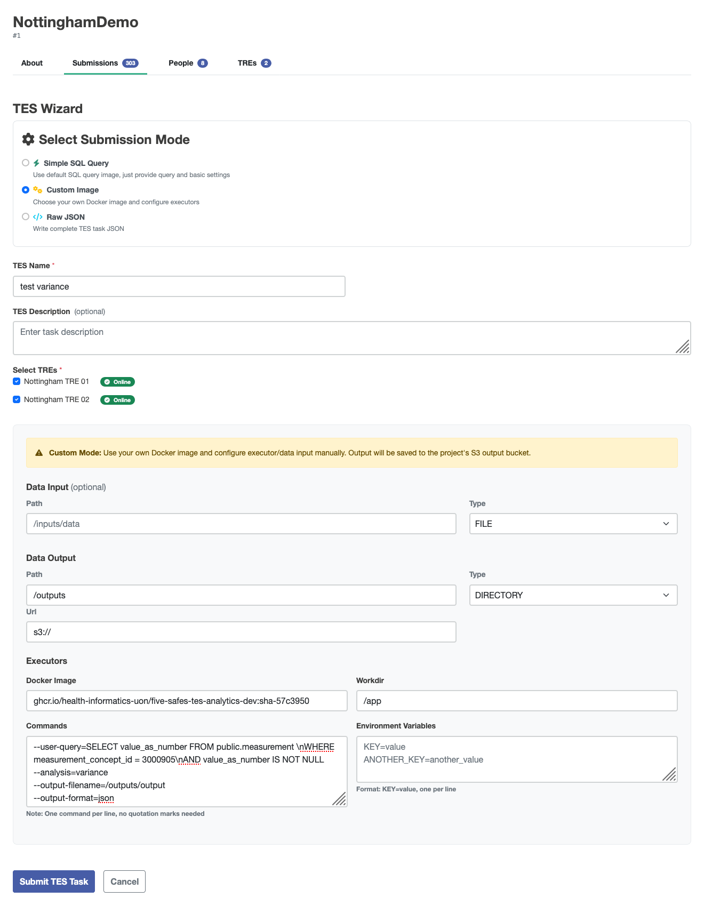

# Aggregating basic statistics

This tutorial can be run as a Jupyter notebook from the [5s-TES notebooks repository](https://github.com/Health-Informatics-UoN/5s-TES-notebooks/)

The outputs from TES tasks can be easily used to calculate basic statistics.
   
   This example will use summary statistics from a dataset in the OMOP common data model.
There is a container which, given a SQL query that filters an OMOP table by your criteria, will calculate the necessary summary statistics for your final analysis.

This example data was collected using the [Custom Image wizard](submission-layer-wizards#custom-image) in the submission layer with these settings changed from default:

| Field   | value                                                                          |
| ------- | ------------------------------------------------------------------------------ |
| image   | ghcr.io/health-informatics-uon/five-safes-tes-analytics-dev:sha-57c3950 |
| workdir | /app |
| command | --user-query=SELECT value_as_number FROM public.measurement \\nWHERE measurement_concept_id = 3000905\\nAND value_as_number IS NOT NULL<br>--analysis=variance<br>--output-filename=/outputs/output<br>--output-format=json<br> |




<details>
    <summary>Expand to view generated JSON</summary>


```
    {
         \"id\": \"450\",
         \"state\": 0,
         \"name\": \"test variance\",
         \"description\": \"Federated analysis task\",
         \"inputs\": null,
         \"outputs\": [
                  {
                           \"name\": \"Query Results\",
                           \"description\": \"Results from the requested query execution\",
                           \"url\": \"s3://\",
                           \"path\": \"/outputs\",
                           \"type\": \"DIRECTORY\"
                  }
         ],
         \"resources\": null,
         \"executors\": [
                  {
                           \"image\": \"ghcr.io/health-informatics-uon/five-safes-tes-analytics-dev:sha-57c3950\",
                           \"command\": [
                                    \"--user-query=SELECT value_as_number FROM public.measurement \\nWHERE measurement_concept_id = 3000905\\nAND value_as_number IS NOT NULL\",
                                    \"--analysis=variance\",
                                    \"--output-filename=/outputs/output\",
                                    \"--output-format=json\"
                           ],
                           \"workdir\": \"/app\",
                           \"stdin\": null,
                           \"stdout\": null,
                           \"stderr\": null,
                           \"env\": {}
                  }
         ],
         \"volumes\": null,
         \"tags\": {
                  \"Project\": \"NottinghamDemo\",
                  \"tres\": \"Nottingham TRE 01|Nottingham TRE 02\"
         },
         \"logs\": null,
         \"creation_time\": null
    }
```
</details>

The `aggregate_utils` module provided with this notebook allows you to calculate statistics for the overall population by aggregating intermediate result

```python
from pathlib import Path
from aggregate_utils import VarianceIntermediate, TTestIntermediate, make_variance_intermediate_from_json, aggregate_variance_intermediates
import numpy as np
```
The example data are held in `./data`

```python
paths = {
    "tre1": "./data/variance-tre-1.json",
    "tre2": "./data/variance-tre-2.json"
}
```

The `make_variance_intermediate_from_json` function reads the data from the JSON file and provides methods for aggregation.
The returned values hold the count (`n`), the sum (`total`), and the sum of squares (`sum_x2`) for the value read from the original table.
These three pieces of information are sufficient to calculate several other summary statistics.

```python
variance_intermediates = {
    k:make_variance_intermediate_from_json(Path(v))
    for k,v in paths.items()
}
variance_intermediates
```

`'tre1': VarianceIntermediate(n=2140, total=10819.0, sum_x2=76707.0),`

`'tre2': VarianceIntermediate(n=4571, total=228747.0, sum_x2=15257585.0)`

For example, the `aggregate_variance_intermediates` function will aggregate these as if they came from a single sample.

```python
aggregated_intermediate = aggregate_variance_intermediates(variance_intermediates.values())
aggregated_intermediate
```

`VarianceIntermediate(n=6711, total=239566.0, sum_x2=15334292.0)`

The `mean` and `variance` properties are for the whole sample.
```python
aggregated_intermediate.mean
```

`35.69751154820444`

```python
aggregated_intermediate.variance
```

`1010.6365591480935`

The values are from a very skewed distribution.
To demonstrate how the same information can be used to conduct other common statistical analyses, random samples from a normal distribution can be generated with this code:

```python
mu, sigma = 50, 10
rng = np.random.default_rng()
s = rng.normal(mu, sigma, 10)
```

A `TTestIntermediate` uses the same three pieces of information as a `VarianceIntermediate`.

```python
gaussian_t_test_intermediate = TTestIntermediate(
    n=len(s),
    total=np.sum(s),
    sum_x2=np.sum(s**2)
)

gaussian_t_test_intermediate
```

`TTestIntermediate(n=10, total=np.float64(476.9742997017046), sum_x2=np.float64(23459.825051161773))`

You can also use this information to perform a one-sample t-test.

```python
gaussian_t_test_intermediate.one_sample_t_test(52)
```

`0.07033644170438572`

There are many other analyses that can be performed with a few building blocks like this.
