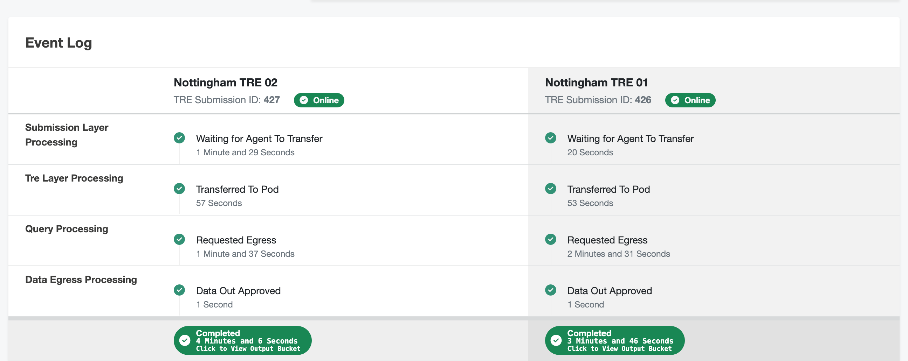

# Collecting results

These instructions assume you have [submitted a task](submitting-to-5s-tes) using one of [the wizards](submission-layer-wizards).

When you have submitted a task, you have to wait for your results to be ready to collect.
If you navigate back to the view of the Submissions to a project from which you can start a wizard, you can view past submissions.
These will have one of four status indicators

-  Running : Your task is still in progress - check the task.
-  Completed : Your task has completed and results are ready to collect.
-  Failed : Your task has failed.
-  Partial result : Your task has failed in at least one of the TREs, and succeeded in at least one.

Clicking on the task name will take you to a summary of the task.
You will be presented with the [TES message](5s-tes-messages) for your task and a summary of the timeline of your task's execution.
At the bottom of this page, you will be shown a log of the events in the execution of your task.

Clicking on the "Completed" indicator of a completed task will take you to a login screen for the bucket used to store this project's results.
It is likely that the bucket can use the credentials you used to sign in to the submission layer to automatically log you in.
Your tasks have a Submission ID, shown under the TRE name, which is used to label the folder inside the bucket so you can find your results.
