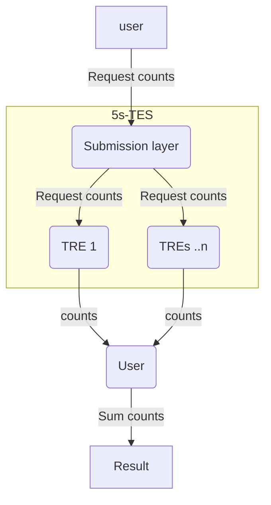
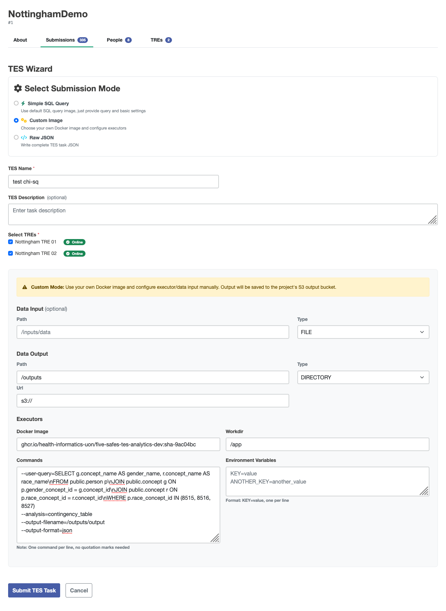

# Aggregating data for contingency tables
Federated analysis on contingency tables is relatively simple.
Counts are easy to federate: each TRE calculates their local count for some group, then these are aggregated by adding the counts together.
Each cell of a contingency table is a count, so the table can be federated by requesting these counts, and then statistical analyses can be performed on the aggregate.



The example data were produced by running the Custom Image wizard using the following parameters:

| Field | value |
| ----- | ----- |
| Docker image| ghcr.io/health-informatics-uon/five-safes-tes-analytics-dev:sha-9ac04bc |
| Workdir | /app |
| Commands | --user-query=SELECT g.concept_name AS gender_name, r.concept_name AS race_name\\nFROM public.person p\\nJOIN public.concept g ON p.gender_concept_id = g.concept_id\\nJOIN public.concept r ON p.race_concept_id = r.concept_id\\nWHERE p.race_concept_id IN (8515, 8516, 8527)<br>--analysis=contingency_table<br>--output-filename=/outputs/output<br>--output-format=json |

The UI should look like this:


<details>
    <summary>Expand for example JSON</summary>

```json
{
         "id": "504",
         "name": "test chi-sq",
         "description": "Federated analysis task",
         "inputs": null,
         "outputs": [
                  {
                           "name": "Query Results",
                           "description": "Results from the requested query execution",
                           "url": "s3://",
                           "path": "/outputs",
                           "type": "DIRECTORY"
                  }
         ],
         "resources": null,
         "executors": [
                  {
                           "image": "ghcr.io/health-informatics-uon/five-safes-tes-analytics-dev:sha-9ac04bc",
                           "command": [
                                    "--user-query=SELECT g.concept_name AS gender_name, r.concept_name AS race_name\nFROM public.person p\nJOIN public.concept g ON p.gender_concept_id = g.concept_id\nJOIN public.concept r ON p.race_concept_id = r.concept_id\nWHERE p.race_concept_id IN (8515, 8516, 8527)",
                                    "--analysis=contingency_table",
                                    "--output-filename=/outputs/output",
                                    "--output-format=json"
                           ],
                           "workdir": "/app",
                           "stdin": null,
                           "stdout": null,
                           "stderr": null,
                           "env": {}
                  }
         ],
         "volumes": null,
         "tags": {
                  "Project": "NottinghamDemo",
                  "tres": "Nottingham TRE 01|Nottingham TRE 02"
         },
         "logs": null,
         "creation_time": null
}
```
</details>

```python
import pandas as pd
from contingency_table_utils import read_contingency_table_from_json, aggregate_tables

from scipy.stats import chi2_contingency
```

The json produced by this analysis can be read into tables using the `contingency_table_utils` module supplied.

```python
tre1 = read_contingency_table_from_json(\"data/tre1.json\")
tre2 = read_contingency_table_from_json(\"data/tre2.json\")
tre1.data
```

| gender_name |                  race_name |    n |
| ----------- | -------------------------- | ---- |
|      FEMALE |                      Asian |   29 |
|      FEMALE |  Black or African American |   44 |
|      FEMALE |                      White |  411 |
|        MALE |                      Asian |   41 |
|        MALE |  Black or African American |   38 |
|        MALE |                      White |  433 |

The data aren't very interesting, as they simply report how many men and women there are of three ethnicities in the synthetic datasets, but they serve to show how contingency tables can be assembled.

`aggregate_tables` checks that your tables have the same variables, and sums the counts if they do.

```python
aggregate = aggregate_tables([tre1, tre2])
```

The `contingency_table` property organises this data into the format for statistical analyses.

```python
aggregate.contingency_table
```

| | FEMALE |   MALE |
| ------------------------- | ------ | ------ |
| Asian                     |   1011 |    982 |
| Black or African American |   1080 |   1022 |
| White                     |   1426 |   1441 |

This format can be used for `scipy.stats` contingency table functions.

```python
chisq = chi2_contingency(aggregate.contingency_table)
print(f\"The p-value for the chi-squared test is {chisq.pvalue:.3f}\")
```

`The p-value for the chi-squared test is 0.508`

Phew, the synthetic data haven't got any surprising imbalances.

This tutorial should show how you can perform federated analyses based on contingency tables of count data.
The key requirement for writing your own analyses is writing a SQL query that, like

```{sql}
SELECT g.concept_name AS gender_name, r.concept_name AS race_name
  FROM public.person p
  JOIN public.concept g ON p.gender_concept_id = g.concept_id
  JOIN public.concept r ON p.race_concept_id = r.concept_id;
```

produces a table of two categorical columns, e.g.

| gender_name | race_name                                 |
| ----------- | ----------------------------------------- |
| FEMALE      | Asian                                     |
| FEMALE      | Black or African American                 |
| FEMALE      | White                                     |
| MALE        | White                                     |
| FEMALE      | Native Hawaiian or Other Pacific Islander |
| MALE        | Native Hawaiian or Other Pacific Islander |
| ...         | ...                                       |
