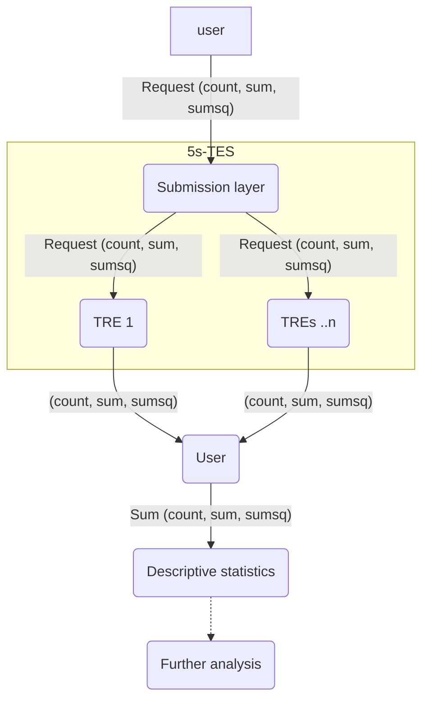

# Descriptive statistics example: mean and variance

Federated analysis can be used to calculate descriptive statistics for a population.
Many univariate statistics can be calculated from the count of a sample, the sum and sum of squares of the variable of interest.



An example of this kind of analysis is shown below, which uses the [Workbench](https://github.com/federated-research/5S-TES-Workbench/) to send SQL queries to two TREs.
This and further examples can be found in the [5s-TES notebooks repository](https://github.com/Health-Informatics-UoN/5s-TES-notebooks/).


- Using the [custom image wizard](./submitting-to-5s-tes#custom-image) and a [python container](https://github.com/Health-Informatics-UoN/5s-TES-notebooks/blob/main/descriptive-stats/aggregating-basic-statistics.ipynb)
- An [end-to-end analysis](https://github.com/Health-Informatics-UoN/5s-TES-notebooks/blob/main/workbench-delphi/Workbench%20Delphi%20100k.ipynb) using the workbench and SQL

## SQL with workbench

This example will use summary statistics from a dataset in the OMOP common data model.
In this example, we use SQL to calculate the sufficient summary statistics from each TRE which can be used to perform the final analysis.

The example here will look at calculating the mean and variance of the systolic blood pressure of patients with, and without, primary malignant neoplasm of skin.
In order to do this, the sufficient statistics are the count, sum and sum of squares, so this is the information that the SQL query produces for each group.

The two OMOP concept IDs used are:

3004249: systolic blood pressure
139750: primary malignant neoplasm of skin

<details>
    <summary>Show SQL</summary>

```python
sys_pressure_neoplasm_query = """
WITH last_occurrence AS (
    SELECT
        person_id,
        value_as_number,
        ROW_NUMBER() OVER (
            PARTITION BY person_id
            ORDER BY measurement_datetime DESC NULLS LAST
        ) AS rn
    FROM "DelphiDemo".measurement
    WHERE measurement_concept_id = 3004249
      AND value_as_number IS NOT NULL
),

value_with_status AS (
    SELECT
        value_as_number,
        CASE
            WHEN person_id IN (
                SELECT person_id
                FROM "DelphiDemo".condition_occurrence
                WHERE condition_concept_id = 139750
            )
            THEN 'with'
            ELSE 'without'
        END AS condition_status
    FROM last_occurrence
    WHERE rn = 1
)

SELECT
    condition_status,
    COUNT(value_as_number) AS count,
    SUM(value_as_number) AS sum,
    SUM(value_as_number * value_as_number) AS sumsq
FROM value_with_status
GROUP BY condition_status;
"""
```
</details>

This is built into a TES message using the Five Safes TES workbench, to run on a synthetic dataset generated by the [Delphi model](https://www.nature.com/articles/s41586-025-09529-3). This is designed to run on a container which will run SQL queries, such as this one: `harbor.federated-analytics.ac.uk/5s-tes-analysis-tools/5s-tes-analysis-tools-tre-sqlpg:1.0.0`, encoded into the template.

<details>
    <summary>Expand to view generated JSON</summary>


```
    {
   "name": "Mean and variance systolic blood pressure",
   "description": "Simple SQL Task",
   "outputs": [
      {
         "url": "s3://",
         "path": "/outputs",
         "type": "DIRECTORY",
         "name": "Output",
         "description": "Output results"
      }
   ],
   "executors": [
      {
         "image": "harbor.federated-analytics.ac.uk/5s-tes-analysis-tools/5s-tes-analysis-tools-tre-sqlpg:1.0.0",
         "command": [
            "--Output=/outputs/output.csv",
            "--Query=\nWITH last_occurrence AS (\n    SELECT\n        person_id,\n        value_as_number,\n        ROW_NUMBER() OVER (\n            PARTITION BY person_id\n            ORDER BY measurement_datetime DESC NULLS LAST\n        ) AS rn\n    FROM \"DelphiDemo\".measurement\n    WHERE measurement_concept_id = 3004249\n      AND value_as_number IS NOT NULL\n),\n\nvalue_with_status AS (\n    SELECT\n        value_as_number,\n        CASE\n            WHEN person_id IN (\n                SELECT person_id\n                FROM \"DelphiDemo\".condition_occurrence\n                WHERE condition_concept_id = 139750\n            )\n            THEN 'with'\n            ELSE 'without'\n        END AS condition_status\n    FROM last_occurrence\n    WHERE rn = 1\n)\n\nSELECT\n    condition_status,\n    COUNT(value_as_number) AS count,\n    SUM(value_as_number) AS sum,\n    SUM(value_as_number * value_as_number) AS sumsq\nFROM value_with_status\nGROUP BY condition_status;\n"
         ]
      }
   ],
   "volumes": [],
   "tags": {
      "project": "DelphiDemo",
      "tres": "Nottingham TRE 01|Nottingham TRE 02"
   },
   "creation_time": "2026-05-26T09:41:36.475188+00:00"
}
```
</details>

The `partialstats` module provided with this notebook allows you to calculate statistics for the overall population by aggregating intermediate result.

```python
from partialstats.partials import SumOfSquaresPartial
from partialstats.combiners import mean_combiner, variance_combiner
from partialstats.combiners.scalar import sum_combiner
```

The query is sent and data retrieved using the workbench, as usual.

As the data is returned from each TRE, we have two files, each with some data for both groups (with neoplasm, and without). It would be a more useful for us to collect all the data for those with neoplasm together into one object, and the data for those without neoplasm into a separate object. We parse the data in a function (`collect_var_data`) to do this, which allows us to put the partial results for each group into separate lists.


```python
with_neoplasm_partials = [collect_var_data(path, group_level = "with") for path in data_paths]
without_neoplasm_partials = [collect_var_data(path, group_level = "without") for path in data_paths]
```

The summary statistics can then be aggregated and the statistics calculated. We have a module to help with this, too - `combiners` in the `partialstats` module.
For both the data with neoplasm and without, we calculate the count, mean and variance using the `combine` functions provided.

```python
count = count_combiner.combine(with_neoplasm_partials)
mean = mean_combiner.combine(with_neoplasm_partials)
variance = variance_combiner.combine(with_neoplasm_partials)
```

The final step is to view the data we have calculated, which can be done simply by creating dictionaries for the aggregate data (one for each group), combining them into a list and using `pandas` to create a table.

```python
with_neoplasm_data = {
    "condition_status": "with neoplasm",
    "count": count,
    "mean_systolic_blood_pressure": mean,
    "variance_systolic_blood_pressure": variance,
    "standard_deviation": standard_deviation,
    }
summary_table = pd.DataFrame([with_neoplasm_data, without_neoplasm_data])
summary_table

```
The table should look like this:

 |condition_status | count     | mean_systolic_blood_pressure | variance_systolic_blood_ressure | standard_deviation |
 |-----------------|-----------|------------------------------|---------------------------------|--------------------|
0| with neoplasm   |1039       |119.491819                    |3.366391                         |1.834773            |
1| without neoplasm|98375      |115.692463                    |43.905909                        |6.626153            |
