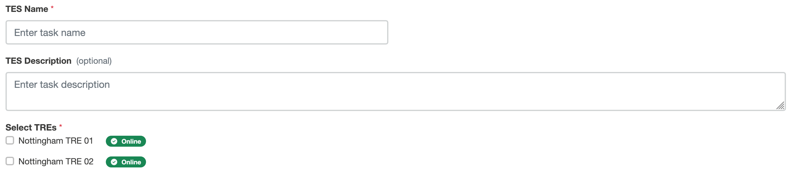
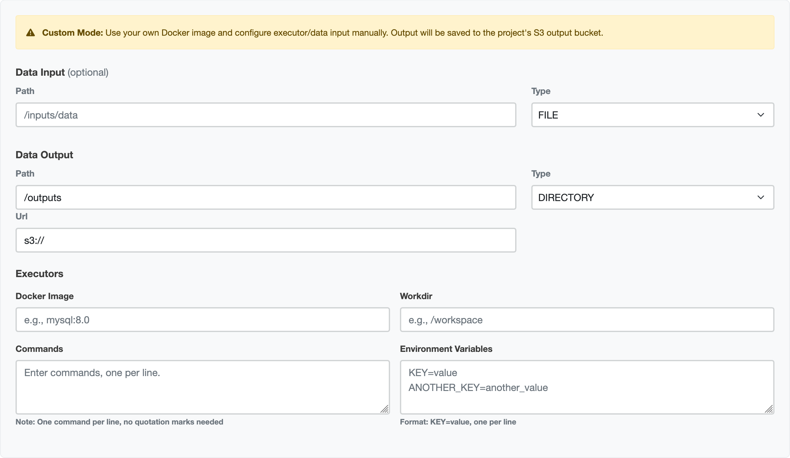

# Submission layer wizards

When [making a submission](submitting-to-5s-tes) using the submission layer web application, you can use the TES wizard.

There are three options:

1. **<span style="color: #204F90">Simple SQL Query</span>**: Executes a default SQL container. Just provide a SQL Query.
2. **<span style="color: #204F90">Custom Image</span>**: Provide details for another image to run, along with commands and environment variables.
3. **<span style="color: #204F90">Raw JSON</span>**: Write [a TES message](5s-tes-messages) for more complex requirements.

## Raw JSON
The Raw JSON wizard has the simplest interface: a single text box for writing a TES message.
This includes syntax highlighting and formatting.

## Common features
The other wizards have some options in common.



### TES Name
Essential.
A text box that populates the `name` field of a TES message, and should be a name that you can recognise, as it is used in the web application as a label for this task.

### TES description
A text box for an optional longer description of the TES message, which populates the `description` field of a TES message.

### Select TREs
Checkboxes showing the TREs available to run tasks on this project.
This part of the user interface also shows which of these TREs are online.

## Simple SQL Query
The Simple SQL Query wizard has a single additional element: a text box for writing a SQL query.

## Custom image


The custom image wizard provides several more options for running tasks.

### Data input
If the TREs support it, you can provide a path to download extra data for input.

- **Path**: a textbox to provide the path from which to collect data
- **Type**: a selection box where you can choose whether your input is a `FILE` or `DIRECTORY`. 

### Data output
You can specify where your output is stored.
The TRE agent will amend this to comply with egress policy.

- **Path**: a textbox to provide the path to which output data should be sent
- **Type**: a selection box where you can choose whether your output is a `FILE` or `DIRECTORY`. 
- **URL**: A text box to specify a URL for storing your data.

### Executors
This section contains details of your executor(s).

- **Docker image**: Executors are containers. This textbox allows you to specify which.
- **Workdir**: The working directory used by this container.
- **Commands**: A textbox for the commands to pass to the container

<div class="info">


The commands that you pass here need to be separated by a new line where normally they would be separated by a space on the command-line.
e.g:
```
--body-json {"code":"GENERIC","analysis":"DISTRIBUTION","uuid":"123","collection":"test","owner":"me"} --no-encode
```

becomes

```
--body-json
{"code":"GENERIC","analysis":"DISTRIBUTION","uuid":"123","collection":"test","owner":"me"}
--no-encode
```
</div>

- **Environment variables**: Some containers will need some environment variables to be passed to them to work. You do not need to specify all of these; for example for many TREs, you will not have database credentials and these will be populated for you.

## Submit task

For all the wizards, there is a button at the bottom to submit your task.


Once this is pressed, the task is sent to the submission layer.
This area will then display your task's progress as it is sent to the TRE agent, then to the TES engine, and when the outputs are being reviewed.

When this is complete, you can [collect your results](collecting-results).
