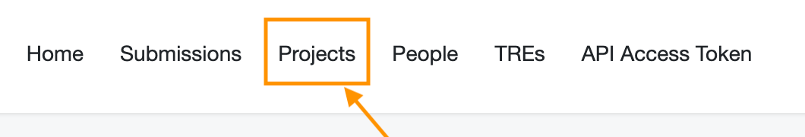
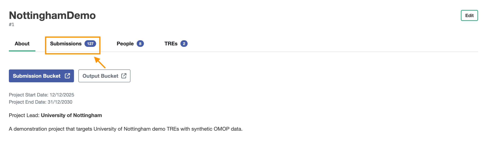
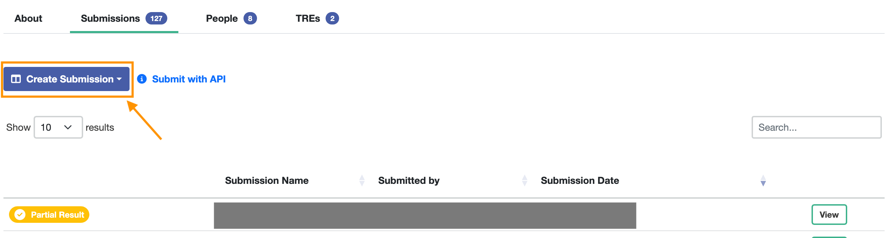

# Submitting to Five Safes TES
Researchers interact with Five Safes TES (5S-TES) using the submission layer.
The submission layer ensures [two of the Five Safes](/examples-in-five-safes-tes#the-five-safes): **Safe People** and **Safe Projects**.
This means you have to become a user, and be added to a project.

## Background
### Projects
5s-TES users do not interact directly with Trusted Research Environments (TREs).
Instead, data access in TREs is scoped by a project, which has a defined time for which it is valid, and defined data users can access through it.
This means that you have to request, and be approved for, permission to make submissions to a project.

### Submissions
A submission means sending a [Five safes TES message](5s-tes-messages) to the submission layer.
The submission layer then uses [tags](examples-in-five-safes-tes/5s-tes-messages#use-of-tags-in-5s-tes) to assign the task to a project and which TREs should run it.

### Authentication
If you are making submissions to 5s-TES using the web application, those interactions are authenticated when you log in.
If you are making submissions programmatically, you will have to authenticate your requests using an API token.
To get an access token, select "API access token" in the top ribbon of the Submission layer web application and copy it to your clipboard.

Tokens expire.
The time and date at which your current token expires are shown above the token

## Preparing for a submission

  

    

      
✓

    

    

      
Are you a Submission layer user?

      
If you are not already a user, an administrator will have to <a href="https://docs.federated-analytics.ac.uk/submission/guides/submissionManagerAddingNewPerson">add a new researcher</a>

    

  

  

    

      
✓

    

    

      
Are you assigned to a project?

      
If not, you cannot make submissions. An administrator will have to <a href="https://docs.federated-analytics.ac.uk/submission/guides/submissionManagerSetupNewProject#add-people-to-the-project">add you to a project</a>

    

  

  

    

      
✓

    

    

      
(Optional) Do you have an access key?

      
If you aren't submitting through the web application, you'll need to get your access key as described above</a>

    

  

## Making a submission through the Web application
As each submission is associated with a project, you make your submissions in the web application by first navigating to the projects view.

In the projects view, you can then select a project you are assigned to.

When you are in the project, you can select the Submissions view.

