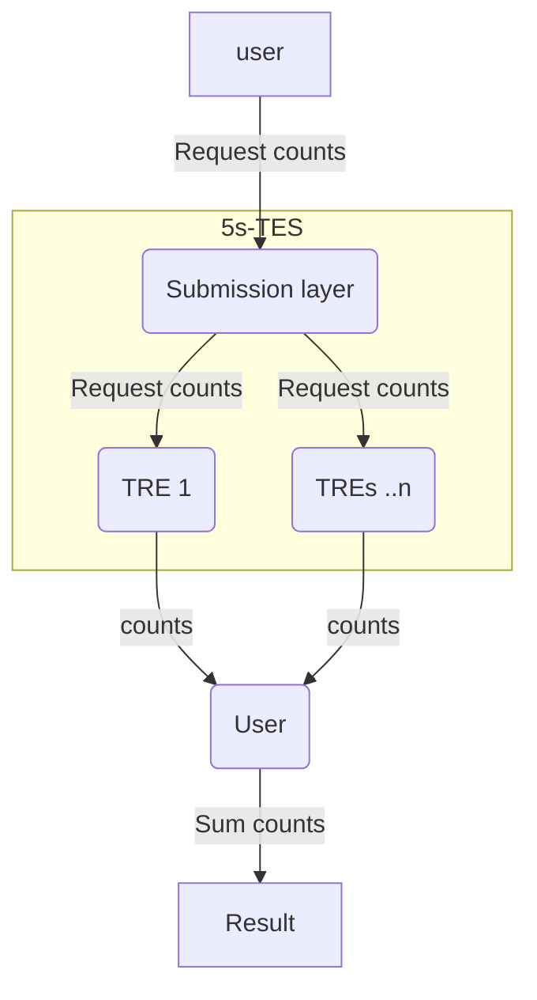

# Contingency tables in SQL with Workbench

This tutorial can be run as a Jupyter notebook from the [5s-TES notebooks repository](https://github.com/Health-Informatics-UoN/5s-TES-notebooks/)

Federated analysis on contingency tables is relatively simple.
Counts are easy to federate: each TRE calculates their local count for some group, then these are aggregated by adding the counts together.
Each cell of a contingency table is a count, so the table can be federated by requesting these counts, and then statistical analyses can be performed on the aggregate.



The example data we will work with here is produced by the following SQL query:

```SQL
hypertension_neoplasm_query = """
WITH hypertension AS (
  SELECT
    person_id,
    CASE
      WHEN person_id IN (
        SELECT person_id
        FROM "DelphiDemo".condition_occurrence
        WHERE condition_concept_id = 320128
      ) THEN 'has_hypertension' ELSE 'no_hypertension' END AS hypertension_status
  FROM "DelphiDemo".person
)

SELECT
  CASE
    WHEN p.person_id IN (
      SELECT person_id
      FROM "DelphiDemo".condition_occurrence
      WHERE condition_concept_id = 139750
    ) THEN 'with'
    ELSE 'without'
    END AS neoplasm_status,
  hypertension.hypertension_status,
  COUNT(p.person_id) as n
FROM "DelphiDemo".person p
  JOIN hypertension ON p.person_id = hypertension.person_id
GROUP BY neoplasm_status, hypertension_status
"""
```

This is built into a TES message using the Five Safes TES workbench, to run on the Delphi dataset. This is designed to run on a container which will run SQL queries, such as this one: `harbor.federated-analytics.ac.uk/5s-tes-analysis-tools/5s-tes-analysis-tools-tre-sqlpg:1.0.0`, which is encoded into the template.


<details>
    <summary>Expand for example JSON</summary>

```json
{
   "name": "hypertension x neoplasm contingency table",
   "description": "Simple SQL Task",
   "outputs": [
      {
         "url": "s3://",
         "path": "/outputs",
         "type": "DIRECTORY",
         "name": "Output",
         "description": "Output results"
      }
   ],
   "executors": [
      {
         "image": "harbor.federated-analytics.ac.uk/5s-tes-analysis-tools/5s-tes-analysis-tools-tre-sqlpg:1.0.0",
         "command": [
            "--Output=/outputs/output.csv",
            "--Query=\nWITH hypertension AS (\n  SELECT\n    person_id,\n    CASE\n      WHEN person_id IN (\n        SELECT person_id\n        FROM \"DelphiDemo\".condition_occurrence\n        WHERE condition_concept_id = 320128\n      ) THEN 'has_hypertension' ELSE 'no_hypertension' END AS hypertension_status\n  FROM \"DelphiDemo\".person\n)\n\nSELECT\n  CASE\n    WHEN p.person_id IN (\n      SELECT person_id\n      FROM \"DelphiDemo\".condition_occurrence\n      WHERE condition_concept_id = 139750\n    ) THEN 'with'\n    ELSE 'without'\n    END AS neoplasm_status,\n  hypertension.hypertension_status,\n  COUNT(p.person_id) as n\nFROM \"DelphiDemo\".person p\n  JOIN hypertension ON p.person_id = hypertension.person_id\nGROUP BY neoplasm_status, hypertension_status\n"
         ]
      }
   ],
   "volumes": [],
   "tags": {
      "project": "DelphiDemo",
      "tres": "Nottingham TRE 01|Nottingham TRE 02"
   },
   "creation_time": "2026-05-14T16:02:13.342420+00:00"
}
```
</details>

The data returned by this analysis can be read into tables using the `contingency_table_utils` module supplied.

```python
paths = wb.fetch_outputs()
contingency_paths = [v[0] for k, v in paths.items()]

pre_contingency_tables = [ContingencyTable(pd.read_csv(path)) for path in contingency_paths]
```

The data can be retrieved from each like this:
`pre_contingency_tables[0].data` and `pre_contingency_tables[1].data`.

The data from each of the two TREs is as follows:

Nottingham TRE 01:
| neoplasm_status | hypertension_status |     n |
| --------------- | ------------------- | ----- |
|         without |     no_hypertension | 48955 |
|            with |     no_hypertension |   532 |
|            with |    has_hypertension |    13 |
|         without |    has_hypertension |   270 |


Nottingham TRE 02:
| neoplasm_status | hypertension_status |     n |
| --------------- | --------------------|------ |
|         without |     no_hypertension | 49012 |
|            with |     no_hypertension |   496 |
|            with |    has_hypertension |     7 |
|         without |    has_hypertension |   247 |


This is useful, but only gives informtation about the data in each TRE individually. In order to derive more value from the data, and perform statistical tests across both groups (the complete data set), the data must be aggregated.

`aggregate_tables` checks that your tables have the same variables, and sums the counts if they do.

```python
aggregated = aggregate_tables(pre_contingency_tables)
contingency_table = aggregated.contingency_table["n"]

display(contingency_table)
```


|hypertension_status	| has_hypertension	| no_hypertension|
| neoplasm_status     |                   |                |
|---------------------|-------------------|----------------|
|with                 |                20 |           1019 |
|without              |               517 |          97967 |


The `contingency_table` property organises this data into the format for statistical analyses.

This format can be used for `scipy.stats` contingency table functions.
